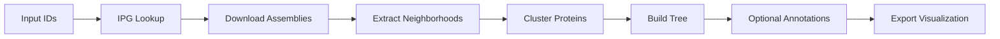

import { Steps, Tabs, Callout, FileTree } from 'nextra/components'

# Step-by-Step Tutorial

This tutorial walks you through the complete Hoodini pipeline, showing both **CLI** and **Python** approaches for each stage.

<Callout type="info" emoji="📓">
  Choose your preferred approach: **CLI** for quick runs, **Python** for custom workflows and programmatic control.
</Callout>

## What You'll Learn

- Run the full pipeline step-by-step
- Understand what each stage produces and what options are available
- Add **custom columns** to your input that appear in the viewer (via inputsheet or Python)
- Configure optional annotation tools

## Pipeline Overview



---

## Quick Start

<Tabs items={['CLI', 'Python']}>
  <Tabs.Tab>
    Run the entire pipeline with a single command:

    ```bash
    hoodini run \
      --input proteins.txt \
      --output my_analysis \
      --num-threads 8 \
      --tree-mode taxonomy \
      --domains pfam \
      --cctyper \
      --genomad
    ```
  </Tabs.Tab>
  <Tabs.Tab>
    Or run programmatically for more control:

    ```python
    from pathlib import Path
    import polars as pl
    import nest_asyncio

    # Required for Jupyter compatibility
    nest_asyncio.apply()

    # Configuration
    input_path = "proteins.txt"
    output_dir = "my_analysis"
    num_threads = 8
    ```
  </Tabs.Tab>
</Tabs>

---

## Pipeline Stages

<Steps>

### Stage 1: Initialize Inputs

Reads your input file and prepares records for the pipeline.

<Tabs items={['CLI', 'Python']}>
  <Tabs.Tab>
    ```bash
    # With a single protein ID (triggers remote BLAST to find homologs)
    hoodini run --input WP_010922251.1 --output my_analysis

    # With a file of protein IDs (one per line, no BLAST)
    hoodini run --input proteins.txt --output my_analysis

    # With a file of nucleotide IDs (one per line)
    hoodini run --input nucleotides.txt --output my_analysis

    # With an input sheet (TSV with custom columns and local files)
    hoodini run --inputsheet my_samples.tsv --output my_analysis
    ```

    <Callout type="warning" emoji="⚠️">
      **Single protein ID mode**: Using a single protein ID triggers a remote BLAST search to find homologs. This can take several minutes. Control it with `--remote-evalue` and `--remote-max-targets`.
    </Callout>
  </Tabs.Tab>
  <Tabs.Tab>
    ```python
    from hoodini.pipeline.initialize import initialize_inputs

    # From a single protein ID (triggers BLAST)
    records = initialize_inputs(
        input_path="WP_010922251.1",
        output=output_dir,
        force=True,
    )

    # From a file of IDs (no BLAST)
    records = initialize_inputs(
        input_path="proteins.txt",
        output=output_dir,
        force=True,
    )

    # From an input sheet with custom columns
    records = initialize_inputs(
        inputsheet="my_samples.tsv",
        output=output_dir,
        force=True,
    )
    ```
  </Tabs.Tab>
</Tabs>

**Supported input formats:**

| Format | Example | Description |
|--------|---------|-------------|
| Single protein ID | `WP_010922251.1` | Triggers BLAST to find homologs |
| Protein ID file | `proteins.txt` | One ID per line, no BLAST |
| Nucleotide ID file | `nucleotides.txt` | One ID per line (contigs, chromosomes) |
| UniProt ID | `P12345` | Auto-converted to NCBI protein ID |
| Coordinates | `NC_000913.3:1000-2000` | Specific genomic region |
| Input sheet | `--inputsheet samples.tsv` | TSV with local file paths |

**Remote BLAST options** (when using single protein ID):

| Option | Default | Description |
|--------|---------|-------------|
| `--remote-evalue` | `1e-5` | E-value threshold for BLAST hits |
| `--remote-max-targets` | `500` | Maximum number of homologs to retrieve |

### Stage 2: Resolve IPG Records

Queries NCBI's **Identical Protein Groups** to find all genomes containing your query proteins. This expands your initial set to all available genomic contexts.

<Tabs items={['CLI', 'Python']}>
  <Tabs.Tab>
    ```bash
    # Get all IPG candidates (default)
    hoodini run --input proteins.txt --output my_analysis --cand-mode any_ipg

    # Keep only the best IPG hit per protein
    hoodini run --input proteins.txt --output my_analysis --cand-mode best_ipg

    # Keep only the best ID per input
    hoodini run --input proteins.txt --output my_analysis --cand-mode best_id

    # One genome per input protein
    hoodini run --input proteins.txt --output my_analysis --cand-mode one_id

    # Only genomes with the same ID as input
    hoodini run --input proteins.txt --output my_analysis --cand-mode same_id
    ```
  </Tabs.Tab>
  <Tabs.Tab>
    ```python
    from hoodini.pipeline.parse_ipg import run_ipg

    records = run_ipg(
        records_df=records,
        cand_mode="any_ipg",  # See options below
    )
    ```
  </Tabs.Tab>
</Tabs>

**Candidate selection modes (`--cand-mode`):**

| Mode | Description | Use case |
|------|-------------|----------|
| `best_id` *(default)* | Best representative per input, protein ID must match | One representative per query |
| `best_ipg` | Best representative per input, allows different IDs | Balanced coverage |
| `same_id` | All IPG records with same protein ID | For non-redundant proteins (`WP_`, `YP_`, `NP_`) |
| `any_ipg` | All genomes from IPG groups | Maximum coverage (can expand massively) |
| `one_id` | First IPG record per input | Minimal set, ignores assembly quality |

<Callout type="warning">
  Using `any_ipg` or `same_id` can dramatically increase the number of neighborhoods if your query protein is highly conserved across many assemblies.
</Callout>

<Callout type="info">
  IPG finds **identical** protein sequences across genomes. BLAST homology search (for similar but not identical proteins) happens in Stage 1 when using single-query mode.
</Callout>

### Stage 3: Extract Neighborhoods

Downloads assemblies from NCBI and extracts genomic contexts around your query proteins.

<Tabs items={['CLI', 'Python']}>
  <Tabs.Tab>
    ```bash
    # Default: ±10kb window (20000 nucleotides total)
    hoodini run --input proteins.txt --output my_analysis

    # Custom window size in nucleotides (±15kb = 30000 total)
    hoodini run --input proteins.txt --output my_analysis \
      --win-mode win_nts --win 30000

    # Window by gene count (20 genes on each side)
    hoodini run --input proteins.txt --output my_analysis \
      --win-mode win_genes --win 20

    # Set minimum window size requirements
    hoodini run --input proteins.txt --output my_analysis \
      --win 20000 --min-win 5000 --min-win-type both

    # Use local assemblies instead of downloading
    hoodini run --input proteins.txt --output my_analysis \
      --assembly-folder /path/to/assemblies

    # Limit concurrent downloads (default: 8)
    hoodini run --input proteins.txt --output my_analysis \
      --max-concurrent-downloads 4
    ```
  </Tabs.Tab>
  <Tabs.Tab>
    ```python
    from hoodini.pipeline.parse_assemblies import run_assembly_parser

    result = run_assembly_parser(
        records_df=records,
        output_dir=output_dir,
        assembly_folder=None,  # None = download from NCBI
        max_concurrent_downloads=8,
        num_threads=8,
        mod="win_nts",    # "win_nts" or "win_genes"
        wn=20000,         # Window size
        min_win=None,     # Minimum window size
        min_win_type="total",  # "total", "upstream", "downstream", "both"
        ncrna=True,       # Run Infernal for ncRNA
        cctyper=True,     # Run CRISPR-Cas typing
        genomad=True,     # Run mobile element detection
    )

    # Unpack results
    records = result["records"]
    all_gff = result["all_gff"]
    all_prots = result["all_prots"]
    all_neigh = result["all_neigh"]
    valid_uids = result["valid_uids"]
    ```
  </Tabs.Tab>
</Tabs>

**Window options:**

| Option | Values | Description |
|--------|--------|-------------|
| `--win-mode` | `win_nts`, `win_genes` | Define window by nucleotides or gene count |
| `--win` | integer | Window size (total, split ±half on each side) |
| `--min-win` | integer | Minimum acceptable window size |
| `--min-win-type` | `total`, `upstream`, `downstream`, `both` | How to apply minimum window requirement |

<Callout type="warning" emoji="⏱️">
  **Download time**: Depends on how many assemblies need downloading. ~100 assemblies typically take 5-15 minutes. Use `--max-concurrent-downloads` to adjust parallelism.
</Callout>

### Stage 4: Cluster Proteins

Groups similar proteins into families for easier visualization. Proteins in the same cluster get the same color in the viewer.

<Tabs items={['CLI', 'Python']}>
  <Tabs.Tab>
    ```bash
    # Diamond DeepClust (default, fast hierarchical clustering)
    hoodini run --input proteins.txt --output my_analysis \
      --clust-method diamond_deepclust

    # DeepMMseqs (MMseqs2-based deep clustering)
    hoodini run --input proteins.txt --output my_analysis \
      --clust-method deepmmseqs

    # JackHMMER iterative search
    hoodini run --input proteins.txt --output my_analysis \
      --clust-method jackhmmer

    # BLASTp all-vs-all
    hoodini run --input proteins.txt --output my_analysis \
      --clust-method blastp
    ```
  </Tabs.Tab>
  <Tabs.Tab>
    ```python
    from hoodini.pipeline.cluster_proteins import cluster_proteins

    all_prots = cluster_proteins(
        all_prots,
        output_dir=output_dir,
        clust_method="diamond_deepclust",
    )
    ```
  </Tabs.Tab>
</Tabs>

**Clustering methods (`--clust-method`):**

| Method | Speed | Description |
|--------|-------|-------------|
| `diamond_deepclust` | ⚡ Fast | Hierarchical clustering with Diamond. Best for most cases |
| `deepmmseqs` | 🐢 Slow | MMseqs2-based deep clustering. Good sensitivity |
| `jackhmmer` | 🐢 Slow | Iterative HMM search. Best sensitivity for divergent proteins |
| `blastp` | ⏱️ Medium | Traditional all-vs-all BLAST. Most thorough |

### Stage 5: Build Phylogenetic Tree

Creates a tree showing relationships between genomes. The tree determines how neighborhoods are ordered in the visualization.

<Tabs items={['CLI', 'Python']}>
  <Tabs.Tab>
    ```bash
    # Taxonomy-based tree (instant, uses NCBI hierarchy)
    hoodini run --input proteins.txt --output my_analysis \
      --tree-mode taxonomy

    # Fast neighbor-joining tree
    hoodini run --input proteins.txt --output my_analysis \
      --tree-mode fast_nj

    # AAI-based tree (protein similarity)
    hoodini run --input proteins.txt --output my_analysis \
      --tree-mode aai_tree

    # ANI-based tree (nucleotide identity)
    hoodini run --input proteins.txt --output my_analysis \
      --tree-mode ani_tree

    # Fast ML tree
    hoodini run --input proteins.txt --output my_analysis \
      --tree-mode fast_ml

    # Use your own tree file
    hoodini run --input proteins.txt --output my_analysis \
      --tree-mode use_input_tree --tree-file my_tree.nwk

    # FoldMason structure-based tree
    hoodini run --input proteins.txt --output my_analysis \
      --tree-mode foldmason_tree

    # Neighborhood similarity tree
    hoodini run --input proteins.txt --output my_analysis \
      --tree-mode neigh_similarity_tree

    # Neighborhood phylogenetic tree
    hoodini run --input proteins.txt --output my_analysis \
      --tree-mode neigh_phylo_tree
    ```
  </Tabs.Tab>
  <Tabs.Tab>
    ```python
    from hoodini.pipeline.taxonomy import parse_taxonomy_and_build_tree

    tree_str, den_data = parse_taxonomy_and_build_tree(
        records=records,
        all_gff=all_gff,
        all_neigh=all_neigh,
        all_prots=all_prots,
        output_dir=output_dir,
        tree_mode="taxonomy",
        num_threads=num_threads,
    )
    ```
  </Tabs.Tab>
</Tabs>

**Tree building methods (`--tree-mode`):**

| Mode | Speed | Description |
|------|-------|-------------|
| `taxonomy` | ⚡ Instant | Builds tree from NCBI taxonomy hierarchy. Pairwise distances computed from taxonomic rank differences |
| `fast_nj` | ⚡ Fast | FAMSA pairwise distance matrix → DecentTree neighbor-joining |
| `aai_tree` | 🔄 Medium | Requires `--pairwise-aai`. DecentTree NJ from AAI distances (100 - AAI%). Missing pairs filled with max+2σ |
| `ani_tree` | 🔄 Medium | Requires `--pairwise-ani`. DecentTree NJ from ANI distances (100 - ANI%). Only meaningful above ~70% ANI |
| `fast_ml` | 🐢 Slow | FAMSA alignment → VeryFastTree maximum likelihood |
| `use_input_tree` | ⚡ Instant | Load user-provided Newick file. Requires `--tree-file path/to/tree.nwk` |
| `foldmason_tree` | 🐢 Slow | Maps proteins to UniProt → fetches AlphaFold structures → FoldMason structural alignment → VeryFastTree. Falls back to `fast_ml` if mapping fails |
| `neigh_similarity_tree` | 🔄 Medium | Jaccard distance from neighborhood gene family presence/absence matrix → hierarchical clustering |
| `neigh_phylo_tree` | 🐢 Slow | Position-weighted neighborhood gene content (genes closer to target weighted higher) → cosine distance → hierarchical clustering |

<Tabs items={['Target protein trees', 'Genome-based trees', 'Neighborhood-based trees']}>
  <Tabs.Tab>
    **Target protein trees** (`taxonomy`, `fast_nj`, `fast_ml`, `foldmason_tree`, `use_input_tree`):
    - Group neighborhoods by the evolutionary relationship of the target protein
    - `taxonomy`: fastest, groups by species/genus/family but doesn't reflect sequence divergence
    - `fast_nj`: good balance of speed and accuracy for most cases
    - `fast_ml`: more accurate topology, slower
    - `foldmason_tree`: best for remote homologs where sequence similarity is low but structure is conserved
  </Tabs.Tab>
  <Tabs.Tab>
    **Genome-based trees** (`aai_tree`, `ani_tree`):
    - Group neighborhoods by overall genome similarity, not target protein
    - Requires running `--pairwise-aai` or `--pairwise-ani` in the pipeline
    - `aai_tree`: works across wider evolutionary distances
    - `ani_tree`: best for closely related genomes (>70% ANI), standard for species delineation
  </Tabs.Tab>
  <Tabs.Tab>
    **Neighborhood-based trees** (`neigh_similarity_tree`, `neigh_phylo_tree`):
    - Group by the **gene content** of the neighborhood, not target protein sequence
    - `neigh_similarity_tree`: binary presence/absence of gene families
    - `neigh_phylo_tree`: accounts for gene position (genes closer to target contribute more)
    - Best for: detecting operon rearrangements, gene gain/loss patterns
  </Tabs.Tab>
</Tabs>

### Stage 6: Pairwise Comparisons (Optional)

Compute similarities between neighborhoods for visualization links.

<Tabs items={['CLI', 'Python']}>
  <Tabs.Tab>
    ```bash
    # Enable protein links (colored ribbons between similar proteins)
    hoodini run --input proteins.txt --output my_analysis --prot-links

    # Enable nucleotide links (synteny ribbons between neighborhoods)
    hoodini run --input proteins.txt --output my_analysis --nt-links

    # Both
    hoodini run --input proteins.txt --output my_analysis \
      --prot-links --nt-links

    # Configure nucleotide alignment method
    hoodini run --input proteins.txt --output my_analysis \
      --nt-links --nt-aln-mode blastn

    # Configure AAI calculation for trees
    hoodini run --input proteins.txt --output my_analysis \
      --tree-mode aai_tree --aai-mode wgrr --min-pident 30
    ```
  </Tabs.Tab>
  <Tabs.Tab>
    ```python
    from hoodini.pipeline.protein_links import run_protein_links
    from hoodini.pipeline.pairwise_nt import run_pairwise_nt

    # Protein links
    pairwise_aa = run_protein_links(
        output_dir=output_dir,
        all_prots=all_prots,
        threads=num_threads,
    )

    # Nucleotide links
    pairwise_ani, nt_links_result = run_pairwise_nt(
        all_neigh=all_neigh,
        all_gff=all_gff,
        output_dir=output_dir,
        nt_links=True,
        threads=num_threads,
    )
    ```
  </Tabs.Tab>
</Tabs>

**Pairwise comparison options:**

| Option | Values | Description |
|--------|--------|-------------|
| `--nt-aln-mode` | `blastn`, `fastani`, `minimap2`, `intergenic_blastn` | Method for nucleotide alignments |
| `--ani-mode` | `skani`, `blastn` | ANI calculation method for trees |
| `--aai-mode` | `wgrr`, `aai` | wGRR (weighted Gene Repertoire Relatedness) or plain AAI |
| `--aai-subset-mode` | `target_prot`, `target_region`, `window` | Which proteins to include in AAI |
| `--min-pident` | float | Minimum percent identity for BLAST hits |

### Stage 7: Annotations (Optional)

Add functional annotations to proteins and neighborhoods.

<Tabs items={['Domains', 'Defense Systems', 'CRISPR & MGEs', 'Other']}>
  <Tabs.Tab>
    **Protein domains** via MetaCerberus (Pfam, TIGRfam, COG, etc.)

    <Tabs items={['CLI', 'Python']}>
      <Tabs.Tab>
        ```bash
        # Annotate with Pfam domains
        hoodini run --input proteins.txt --output my_analysis --domains pfam

        # Multiple databases (comma-separated)
        hoodini run --input proteins.txt --output my_analysis \
          --domains pfam,tigrfam,cog
        ```

        Available domain databases: `pfam`, `tigrfam`, `cog`, `kegg`, `cazy`, `vog`, `phrogs`
      </Tabs.Tab>
      <Tabs.Tab>
        ```python
        from hoodini.extra_tools.domain import run_domain

        domains_data = run_domain(
            all_prots,
            output_dir,
            ["pfam", "tigrfam"],  # List of databases
            num_threads
        )
        ```
      </Tabs.Tab>
    </Tabs>
  </Tabs.Tab>
  <Tabs.Tab>
    **PADLOC & DefenseFinder** for anti-phage defense systems

    <Tabs items={['CLI', 'Python']}>
      <Tabs.Tab>
        ```bash
        # PADLOC for defense systems
        hoodini run --input proteins.txt --output my_analysis --padloc

        # DefenseFinder for defense systems
        hoodini run --input proteins.txt --output my_analysis --deffinder

        # Both
        hoodini run --input proteins.txt --output my_analysis \
          --padloc --deffinder
        ```
      </Tabs.Tab>
      <Tabs.Tab>
        ```python
        from hoodini.extra_tools.padloc import run_padloc
        from hoodini.extra_tools.defensefinder import run_defensefinder

        padloc_df = run_padloc(all_gff, all_prots, output_dir, num_threads)
        deffinder_df = run_defensefinder(all_gff, all_prots, output_dir)

        # Merge annotations into proteins
        all_prots = all_prots.join(padloc_df, on="id", how="left")
        all_prots = all_prots.join(deffinder_df, on="id", how="left")
        ```
      </Tabs.Tab>
    </Tabs>
  </Tabs.Tab>
  <Tabs.Tab>
    **CCTyper** (CRISPR-Cas), **geNomad** (mobile elements), **Infernal** (ncRNA)

    <Tabs items={['CLI', 'Python']}>
      <Tabs.Tab>
        ```bash
        # CRISPR-Cas detection with CCTyper
        hoodini run --input proteins.txt --output my_analysis --cctyper

        # Mobile genetic elements with geNomad
        hoodini run --input proteins.txt --output my_analysis --genomad

        # Non-coding RNA with Infernal
        hoodini run --input proteins.txt --output my_analysis --ncrna

        # All three
        hoodini run --input proteins.txt --output my_analysis \
          --cctyper --genomad --ncrna
        ```
      </Tabs.Tab>
      <Tabs.Tab>
        ```python
        from hoodini.extra_tools.cctyper import run_cctyper
        from hoodini.extra_tools.genomad import run_genomad

        # CRISPR-Cas detection
        cctyper_df, crispr_df = run_cctyper(
            all_gff, all_prots, all_neigh,
            output_dir, num_threads, valid_uids
        )
        if cctyper_df.height > 0:
            all_prots = all_prots.join(cctyper_df, on="id", how="left")

        # Mobile genetic elements
        genomad_df = run_genomad(all_neigh, output_dir, num_threads, valid_uids)
        ```
      </Tabs.Tab>
    </Tabs>
  </Tabs.Tab>
  <Tabs.Tab>
    **eggNOG-mapper** and **sORF reannotation**

    <Tabs items={['CLI', 'Python']}>
      <Tabs.Tab>
        ```bash
        # eggNOG-mapper for functional annotation
        hoodini run --input proteins.txt --output my_analysis --emapper

        # Reannotate small ORFs that might be missed
        hoodini run --input proteins.txt --output my_analysis --sorfs
        ```
      </Tabs.Tab>
      <Tabs.Tab>
        ```python
        # These run as part of the annotation stage
        # See API reference for details
        ```
      </Tabs.Tab>
    </Tabs>
  </Tabs.Tab>
</Tabs>

### Stage 8: Export Visualization

Package everything into the interactive viewer.

<Tabs items={['CLI', 'Python']}>
  <Tabs.Tab>
    The CLI automatically exports the visualization. Find it at:

    ```bash
    # Open the visualization (macOS)
    open my_analysis/hoodini-viz/hoodini-viz.html

    # Open the visualization (Linux)
    xdg-open my_analysis/hoodini-viz/hoodini-viz.html

    # Or just open in your browser manually
    firefox my_analysis/hoodini-viz/hoodini-viz.html
    ```
  </Tabs.Tab>
  <Tabs.Tab>
    ```python
    from hoodini.pipeline.write_data import write_viz_outputs

    viz_dir = write_viz_outputs(
        output_dir=output_dir,
        all_gff=all_gff,
        all_neigh=all_neigh,
        all_prots=all_prots,
        den_data=den_data,
        tree_str=tree_str,
        records=records,
        nt_links=nt_links_result if 'nt_links_result' in dir() else None,
        pairwise_aa=pairwise_aa if 'pairwise_aa' in dir() else None,
        domains_data=domains_data if 'domains_data' in dir() else None,
        write_domains=True,
        crispr_df=crispr_df if 'crispr_df' in dir() else None,
        genomad_df=genomad_df if 'genomad_df' in dir() else None,
    )

    print(f"✅ Visualization ready at: &#123;viz_dir&#125;/hoodini-viz.html")
    ```
  </Tabs.Tab>
</Tabs>

</Steps>

---

## Output Structure

<FileTree>
  <FileTree.Folder name="my_analysis" defaultOpen>
    <FileTree.Folder name="hoodini-viz" defaultOpen>
      <FileTree.Folder name="parquet" defaultOpen>
        <FileTree.File name="gff.parquet" />
        <FileTree.File name="hoods.parquet" />
        <FileTree.File name="protein_metadata.parquet" />
        <FileTree.File name="tree_metadata.parquet" />
        <FileTree.File name="domains.parquet" />
        <FileTree.File name="nucleotide_links.parquet" />
        <FileTree.File name="protein_links.parquet" />
      </FileTree.Folder>
      <FileTree.Folder name="tsv">
        <FileTree.File name="gff.gff" />
        <FileTree.File name="hoods.txt" />
        <FileTree.File name="protein_metadata.txt" />
        <FileTree.File name="tree_metadata.txt" />
      </FileTree.Folder>
      <FileTree.File name="tree.nwk" />
      <FileTree.File name="hoodini-viz.html" />
    </FileTree.Folder>
    <FileTree.Folder name="assembly_folder">
      <FileTree.File name="GCA_000001234.1/" />
      <FileTree.File name="GCA_000005678.1/" />
    </FileTree.Folder>
    <FileTree.File name="all_neigh.tsv" />
    <FileTree.File name="records.csv" />
  </FileTree.Folder>
</FileTree>

---

## Adding Custom Columns

One of Hoodini's powerful features is **passing custom metadata** through the pipeline to the visualization. Any extra columns you add will appear in the viewer's tooltip and can be used for filtering/coloring.

<Callout type="info" emoji="💡">
  There are **two ways** to add custom columns:
  1. **Input sheet** - Add columns to your TSV input file
  2. **Python** - Add columns to the Polars DataFrames mid-pipeline
</Callout>

### Method 1: Input Sheet with Custom Columns

Create a TSV file with your custom columns alongside the required ones.

<Tabs items={['CLI', 'Python']}>
  <Tabs.Tab>
    Create `my_samples.tsv`:

    ```tsv filename="my_samples.tsv"
    protein_id	nucleotide_id	sample_source	collection_date	host_species	my_category
    WP_010922251.1	NC_002516.2	soil	2023-01-15	environmental	group_A
    WP_002989955.1	NC_003028.3	clinical	2022-06-20	human	group_B
    NP_472073.1	NC_000964.3	marine	2021-11-30	fish	group_A
    ```

    Then run:

    ```bash
    hoodini run --inputsheet my_samples.tsv --output my_analysis --num-threads 8
    ```

    Your custom columns (`sample_source`, `collection_date`, `host_species`, `my_category`) will flow through the entire pipeline and appear in the visualization.
  </Tabs.Tab>
  <Tabs.Tab>
    ```python
    import polars as pl
    from hoodini.pipeline.initialize import initialize_inputs

    # Create input with custom columns
    input_data = pl.DataFrame({
        "protein_id": ["WP_010922251.1", "WP_002989955.1", "NP_472073.1"],
        "nucleotide_id": ["NC_002516.2", "NC_003028.3", "NC_000964.3"],
        # Custom columns - these will appear in the visualization!
        "sample_source": ["soil", "clinical", "marine"],
        "collection_date": ["2023-01-15", "2022-06-20", "2021-11-30"],
        "host_species": ["environmental", "human", "fish"],
        "resistance_profile": ["MDR", "susceptible", "unknown"],
        "my_group": ["A", "B", "A"],
    })

    # Save and run
    input_data.write_csv("my_samples.tsv", separator="\t")

    records = initialize_inputs(
        inputsheet="my_samples.tsv",
        output=output_dir,
        force=True,
    )

    # Your custom columns are now in records!
    print(records.columns)
    # ['protein_id', 'nucleotide_id', 'sample_source', 'collection_date', ...]
    ```
  </Tabs.Tab>
</Tabs>

### Method 2: Adding Columns Mid-Pipeline (Python only)

You can add or modify columns at any point during the pipeline using Polars operations:

```python
import polars as pl

# === After initialization: Add computed columns ===
records = records.with_columns(
    # Classify based on taxonomy
    pl.when(pl.col("taxid").is_in([562, 573, 287]))
      .then(pl.lit("pathogen"))
      .otherwise(pl.lit("environmental"))
      .alias("pathogen_status"),

    # Add a constant label
    pl.lit("experiment_2024").alias("batch_id"),
)

# === Join external metadata ===
external_data = pl.read_csv("my_annotations.tsv", separator="\t")
records = records.join(
    external_data,
    on="protein_id",
    how="left"
)

# === After extraction: Add to protein metadata ===
all_prots = all_prots.with_columns(
    pl.when(pl.col("length") > 500)
      .then(pl.lit("large"))
      .otherwise(pl.lit("small"))
      .alias("size_category")
)

# === Add to neighborhood data ===
all_neigh = all_neigh.with_columns(
    pl.col("gc_content").round(2).alias("gc_percent")
)
```

<Callout type="info" emoji="💡">
  **When to use each method:**
  - **Input sheet**: Best for metadata you already have (sample info, experimental conditions)
  - **Mid-pipeline Python**: Best for computed values (classifications, joined data, derived metrics)
</Callout>

### Required vs Custom Columns

<Tabs items={['Required Columns', 'Optional Built-in', 'Custom Columns']}>
  <Tabs.Tab>
    These columns are **required** for inputsheet mode:

    | Column | Description |
    |--------|-------------|
    | `protein_id` | NCBI protein accession |
    | `nucleotide_id` | NCBI nucleotide accession |

    If providing **local files**, also include:

    | Column | Description |
    |--------|-------------|
    | `gff_path` | Path to GFF3 annotation file |
    | `fna_path` | Path to genome FASTA file |
    | `faa_path` | Path to protein FASTA file |
  </Tabs.Tab>
  <Tabs.Tab>
    These columns are **recognized** and processed specially:

    | Column | Description |
    |--------|-------------|
    | `uniprot_id` | UniProt accession (auto-converted to NCBI) |
    | `taxid` | NCBI taxonomy ID |
    | `assembly_id` | Assembly accession |
    | `input_type` | `"protein"` or `"nucleotide"` |
    | `organism` | Species name |
  </Tabs.Tab>
  <Tabs.Tab>
    **Any other column** you add will be preserved and appear in the visualization!

    Examples:
    - `sample_source` - Where the sample came from
    - `collection_date` - When it was collected
    - `host_species` - Host organism
    - `experiment_id` - Your lab's tracking ID
    - `phenotype` - Observed characteristics
    - `antibiotic_resistance` - Resistance profile
    - `my_category` - Any custom grouping
  </Tabs.Tab>
</Tabs>

### Viewing Custom Data in the Visualization

After running the pipeline, your custom columns appear in:

1. **Tree metadata** - Hover over leaves to see sample info
2. **Neighborhood tooltips** - Click neighborhoods to see associated metadata
3. **Filtering sidebar** - Use custom columns to filter/highlight specific groups
4. **Color by** - Categorical columns can be used to color the tree or neighborhoods

---

## Complete Examples

<Tabs items={['CLI', 'Python']}>
  <Tabs.Tab>
    ```bash filename="run_hoodini.sh"
    #!/bin/bash
    # Complete Hoodini pipeline with all options

    hoodini run \
      --inputsheet cas9_proteins.tsv \
      --output cas9_analysis \
      --num-threads 8 \
      --win-mode win_nts \
      --win 20000 \
      --cand-mode any_ipg \
      --clust-method diamond_deepclust \
      --tree-mode taxonomy \
      --domains pfam,tigrfam \
      --cctyper \
      --genomad \
      --ncrna

    echo "🎉 Done! Open cas9_analysis/hoodini-viz/hoodini-viz.html"
    ```
  </Tabs.Tab>
  <Tabs.Tab>
    ```python filename="run_hoodini.py"
    #!/usr/bin/env python3
    """Complete hoodini pipeline example with custom columns."""

    from pathlib import Path
    import polars as pl
    import nest_asyncio

    nest_asyncio.apply()

    # === CONFIGURATION ===
    output_dir = "cas9_analysis"
    num_threads = 8

    # === CREATE INPUT WITH CUSTOM COLUMNS ===
    input_data = pl.DataFrame({
        "protein_id": [
            "WP_010922251.1",  # Cas9 from S. pyogenes
            "WP_002989955.1",  # Cas9 from S. thermophilus
            "NP_472073.1",     # Cas9 from S. aureus
        ],
        "nucleotide_id": [
            "NC_002516.2",
            "NC_003028.3",
            "NC_000964.3",
        ],
        # Custom metadata
        "species": ["S. pyogenes", "S. thermophilus", "S. aureus"],
        "cas_type": ["II-A", "II-A", "II-A"],
        "pam_sequence": ["NGG", "NNAGAAW", "NNGRRT"],
        "clinical_relevance": ["high", "food_industry", "high"],
    })
    input_data.write_csv("cas9_proteins.tsv", separator="\t")

    # === RUN PIPELINE ===
    from hoodini.pipeline.initialize import initialize_inputs
    from hoodini.pipeline.parse_ipg import run_ipg
    from hoodini.pipeline.parse_assemblies import run_assembly_parser
    from hoodini.pipeline.cluster_proteins import cluster_proteins
    from hoodini.pipeline.taxonomy import parse_taxonomy_and_build_tree
    from hoodini.pipeline.write_data import write_viz_outputs
    from hoodini.extra_tools.domain import run_domain

    # Stage 1-2: Initialize and resolve IPG
    records = initialize_inputs(
        inputsheet="cas9_proteins.tsv",
        output=output_dir,
        force=True
    )
    records = run_ipg(records, cand_mode="any_ipg")

    # Stage 3: Extract neighborhoods
    result = run_assembly_parser(
        records, output_dir,
        num_threads=num_threads,
        mod="win_nts",
        wn=20000,
        cctyper=True,
        genomad=True,
    )
    all_gff = result["all_gff"]
    all_prots = result["all_prots"]
    all_neigh = result["all_neigh"]
    records = result["records"]

    # === ADD COMPUTED COLUMNS MID-PIPELINE ===
    records = records.with_columns(
        pl.when(pl.col("species").str.contains("pyogenes|aureus"))
          .then(pl.lit("human_pathogen"))
          .otherwise(pl.lit("non_pathogen"))
          .alias("pathogenicity")
    )

    # Stage 4-5: Cluster and build tree
    all_prots = cluster_proteins(
        all_prots, output_dir,
        clust_method="diamond_deepclust"
    )
    tree_str, den_data = parse_taxonomy_and_build_tree(
        records, all_gff, all_neigh, all_prots,
        output_dir,
        tree_mode="taxonomy",
        num_threads=num_threads
    )

    # Stage 6: Annotate domains
    domains_data = run_domain(all_prots, output_dir, ["pfam"], num_threads)

    # Stage 7: Export
    viz_dir = write_viz_outputs(
        output_dir, all_gff, all_neigh, all_prots, den_data, tree_str,
        records=records,
        domains_data=domains_data,
        write_domains=True,
    )

    print(f"🎉 Done! Open &#123;viz_dir&#125;/hoodini-viz.html in your browser")
    ```
  </Tabs.Tab>
</Tabs>

---

## Next Steps

- **[CLI Reference](cli-reference)** - Full command-line options with descriptions
- **[Outputs](outputs)** - Detailed output file formats
- **[API Reference](api/reference)** - Complete Python API documentation
